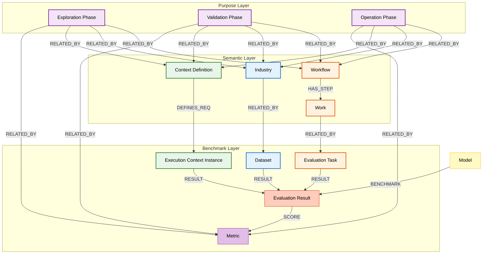

# Semantic Atlas Ontology

벤치마크 온톨로지입니다.

```sql
(:purpose)
	-[:RELATED_BY {weight: 0.00}]->(:workflow)
		-[:HAS_STEP]->(:work)
			->[:RELATED_BY {weight: 0.00}]->(:evaluation_task)
	-[:RELATED_BY {weight: 0.00}]->(:industry)
	    -[:RELATED_BY {weight: 0.00}]->(:dataset)
	-[:RELATED_BY {weight: 0.00}]->(:context_definition)
        -[:RELATED_BY {weight: 0.00}]->(:execution_context)
	-[:RELATED_BY {weight: 0.00}]->(:evaluation_metric)

(:model)
	-[:BENCHMARK]->(:evaluation_result)
		<-[:RESULT]-(:evaluation_task)
		<-[:RESULT]-(:dataset)
		<-[:RESULT]-(:execution_context)
		-[:SCORE]->(:evaluation_metric)
```



# **암묵지적 출력 비중과 통제가능성의 트레이드오프: AI Workflow 설계 원칙**

[AI_Control_Cost_and_The_Implicit_Tradeoff.pdf](Semantic%20Atlas%20Ontology/AI_Control_Cost_and_The_Implicit_Tradeoff.pdf)

## **1. 기본 명제 (Generalized Statement)**

AI Workflow에서 암묵지적 출력(implicit output)의 비중이 증가할수록, 다음과 같은 경향이 동시에 나타난다.

- 운영 비용(Operation Cost)은 증가한다.
- 설명가능성(Explainability)은 감소한다.
- 통제가능성(Controllability)은 감소한다.

이는 특정 모델이나 구현 방식의 문제가 아니라, 구조적으로 반복되는 일반 법칙으로 간주할 수 있다.

## **2. 왜 이런 트레이드오프가 발생하는가**

암묵지적 출력이 증가한다는 것은, 의미 생성과 판단이 점점 다음 특성을 띠게 된다는 뜻이다.

- 내부 표현이 외부로 드러나지 않는다.
- 판단 기준이 명시적 규칙이 아니라 모델 내부 상태에 의존한다.
- 오류의 원인 분해가 어려워진다.

그 결과:

- 운영자는 더 많은 모니터링과 보정 작업을 수행해야 하고
- 문제 발생 시 재학습·재튜닝·사후 분석 비용이 증가하며
- Fallback 설계가 어려워진다.

즉, “자동화가 늘수록 운영이 쉬워진다”는 직관은 여기서 깨진다.

## **3. 두 개의 핵심 축 정의**

이 관계를 두 개의 축으로 정리할 수 있다.

### **3.1 통제가능성 Axis**

통제가능성은 다음 질문으로 정의된다.

어떤 결과가 나와도, 외부 규칙과 절차를 통해 허용·차단·회복이 가능한가?

통제가능성이 높을수록:

- 판단 기준이 명시적이다.
- Threshold와 정책을 외부에서 조정할 수 있다.
- Audit과 설명이 가능하다.

### **3.2 운영비용 Axis**

운영비용은 단순한 인프라 비용이 아니라, 유지·보정·설명에 필요한 총 비용을 의미한다.

운영비용에는 다음이 포함된다.

- Drift 대응 비용
- 재학습 및 튜닝 비용
- 예외 처리 및 고객 대응 비용
- 사고 분석 및 보고 비용

## **4. 암묵지 비중과 두 축의 관계**

이를 정성적으로 표현하면 다음과 같다.

- 암묵지 비중이 낮을수록
→ 통제가능성은 높고, 운영비용은 낮다.
- 암묵지 비중이 높아질수록
→ 통제가능성은 감소하고, 운영비용은 증가한다.

즉, 두 축은 다음과 같은 관계를 갖는다.

$$
\text{Implicitness} \uparrow\;\Rightarrow\;\text{Controllability} \downarrow,\quad\text{OperationCost} \uparrow
$$

## **5. 최적점은 존재한다 (중요)**

중요한 점은 다음이다.

> 통제가능성을 최대화하는 지점도, 운영비용을 최소화하는 지점도 실제로는 최적이 아니다.
> 

왜냐하면:

- 통제만 강조하면 자동화의 이점을 잃고
- 암묵지를 극대화하면 시스템이 불안정해지기 때문이다.

따라서 목표는 다음과 같이 정의된다.

주어진 도메인에서 통제가능성과 운영비용의 균형이 가장 좋은 지점, 즉 Pareto-optimal point를 찾는 것

## **6. 도메인별로 최적점이 달라지는 이유**

이 최적점은 `분야별(parameterized)`로 달라진다.

**예시**

- 법률 / 금융 / 의료
    - 통제가능성 가중치가 매우 높음
    - 암묵지 허용 범위가 좁음
    - 운영비용 증가를 감수함
- 고객 상담 / 추천 / 검색
    - 일정 수준의 암묵지 허용 가능
    - 운영비용과 성능의 균형이 중요
- 창작 / 아이디어 생성
    - 통제가능성 요구 낮음
    - 암묵지 비중 높아도 문제 없음

이를 수식적으로 표현하면 다음과 같다.

$$
\text{Optimal Point}=\arg\min_x\Bigl(\lambda_d \cdot \text{OperationCost}(x)\mu_d \cdot (1 - \text{Controllability}(x))\Bigr)
$$

- λ_d, μ_d: 도메인 d별 가중치

## **7. Semantic Atlas 관점에서의 해석**

Semantic Atlas Benchmark는 이 트레이드오프를 측정 가능한 지표로 바꾸는 장치다.

- softmax score
- margin
- entropy
- Over-Compression / Over-Explanation

이 지표들을 통해:

- 암묵지 출력이 어디까지 허용되는지
- 어느 지점에서 Fallback이 필요한지
- 운영비용 폭증 구간이 어디인지

를 사전에 감지할 수 있다.

## **8. 한 문장으로 일반화된 원칙**

> AI Workflow에서 암묵지적 출력의 비중을 높일수록자동화는 강화되지만, 그 대가로 통제가능성과 설명가능성이 감소하고 운영비용은 증가한다.
> 

> Semantic Atlas의 목표는 이를 제거하는 것이 아니라, 도메인별 최적 균형점을 찾는 것이다.
> 

# **Semantic Category의 시간 종속성과 모델·시스템 교체 고려 시점 정의**

참조

[Semantic Category Benchmark - 인간의 관측 해상도 관점에서의 의미적 범주 측정 방안](https://www.notion.so/Semantic-Category-Benchmark-2fa5de36a790801f9e4df1fee0f73dbd?pvs=21) 

## **1. 전제 정리**

Semantic Atlas 관점에서 다음 두 사실은 동시에 성립한다.

1. Semantic은 시간에 종속된다.
    - 의미 범주(S_t)
    - 사용자 평균(User Average)
    - 온톨로지 구조
    는 모두 시계열적으로 변화한다.
2. 통제가능성·운영비용 기준점은 ‘당시간대’를 기준으로 정규화된다.
    - 과거의 절대 성능이 아니라
    - 현재 시점 t에서의 상대적 적합성을 본다.

즉, 모델은 “노후화”되는 것이 아니라 `Semantic Drift`에 의해 상대적으로 부적합해진다.

## **2. 두 축은 시간에 따라 이동한다**

앞서 정의한 두 축을 다시 쓰면 다음과 같다.

- 통제가능성 Axis
- 운영비용 Axis

이 두 값은 고정된 절대값이 아니라,

항상 시점 t에서 다음과 같이 측정된다.

$$
\text{Controllability}_t,\text{OperationCost}_t
$$

즉,

- 모델의 성능이 그대로여도
- Semantic Atlas(S_t)가 이동하면
- 상대 위치는 변한다.

## **3. Threshold는 “시간 고정값”이 아니라 “시간 정규화 기준”이다**

중요한 포인트는 다음이다.

> 교체 기준 Threshold는 모든 시간을 관통하는 절대 기준이 아니라, 해당 시간대의 운영 요구와 Semantic 구조에 맞춰 정규화된 기준점이다.
> 

이를 형식적으로 쓰면:

$$
\theta_t =(\theta^{\mathrm{control}}_t,\; \theta^{\mathrm{cost}}_t)
$$

- θ_t: 시점 t의 허용 기준점
- 규제, 사용자 기대, 도메인 성숙도에 따라 달라짐

# **4. 교체 고려 시점의 정의 (핵심)**

> 특정 모델 또는 시스템이 시점 t에서 측정된 통제가능성 또는 운영비용이 `사전에 정의된 임계 기준 θ_t`에 미달하는 순간은, 해당 모델·시스템을 `교체 고려 대상`으로 분류하는 시점이다.
> 

수식으로 쓰면:

$$
\text{ReplaceCandidate}(M, t)\;\;\text{iff}\;\;\text{Controllability}_t(M) < \theta^{\mathrm{control}}_t\;\lor\;\text{OperationCost}_t(M) > \theta^{\mathrm{cost}}_t
$$

여기서 중요한 점:

- 즉시 교체가 아니다
- `검토 대상`으로 전환되는 시점이다

# **5. 왜 이 정의가 강한가**

이 정의의 장점은 다음과 같다.

- 성능 하락을 “느낌”으로 판단하지 않는다.
- 새로운 모델이 나와서가 아니라
기존 모델이 현재 Semantic 환경에 부적합해졌는지를 본다.
- 모델 자체의 우열이 아니라
환경 대비 상대적 적합성을 평가한다.

즉,

> 교체의 원인은 모델 내부가 아니라, 모델과 Semantic 환경의 불일치다.
> 

# **6. 운영 관점에서의 의미**

이렇게 정의하면, 교체 논의는 다음 순서를 갖는다.

1. Semantic Atlas Benchmark로
현재 위치를 두 축에서 측정
2. 현재 시점 t의 기준선 θ_t와 비교
3. Threshold 미달 → 교체 고려 상태 진입
4. 이후 선택지:
    - 파라미터 조정
    - 스캐폴드 강화
    - 온톨로지 재구성
    - 모델 교체

즉, 모델 교체는 최후 수단으로 자연스럽게 위치한다.

# **7. 한 문장으로 일반화**

> Semantic이 시간에 종속되는 환경에서, 모델 또는 시스템이 당시간대 기준으로 정규화된 통제가능성·운영비용 임계선에 미달하는 시점은 그 모델을 교체 고려 대상으로 전환해야 하는 시점이다.
> 

이 문장은 그대로

- 운영 정책 문서
- 모델 수명 관리 기준
- AI 거버넌스 문서

에 들어가도 중심 문장이 됩니다. 다음으로 자연스럽게 이어질 질문은 이것입니다.

<aside>
💡

“이 Threshold θ_t를 누가, 어떻게, 얼마나 자주 조정하는가?”

</aside>